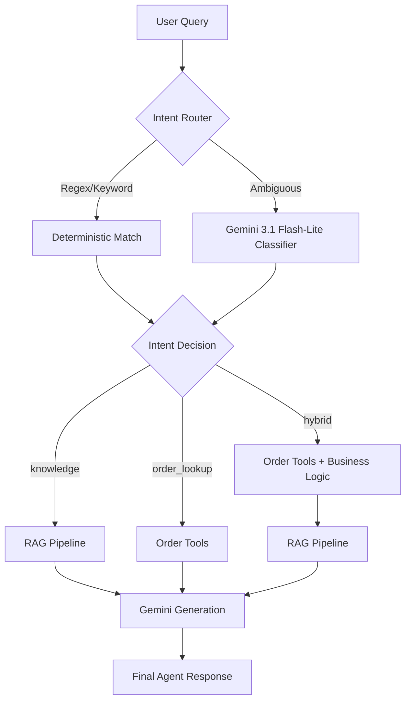

# Mini Support Agent

A modular AI support agent for a fictional e-commerce seller.

## Architecture

The system is designed with a strict separation of concerns, ensuring that deterministic data lookups are never hallucinated by an LLM, and that semantic queries are properly grounded using RAG.

**Key Components:**
1. **Router (`router.py`)**: A keyword-first intent routing mechanism. If a query matches specific regex or keywords, it is instantly routed. Only ambiguous queries fall back to the LLM for classification. This is faster, cheaper, and more reliable than pure LLM routing.
2. **Order Tools (`tools.py`)**: Granular, deterministic functions that read from `orders.csv` via pandas. By keeping lookups strictly programmatic, we eliminate the risk of hallucinating order statuses, prices, or delivery dates.
3. **RAG Pipeline (`rag.py`)**: Uses `sentence-transformers` for local embedding generation and `faiss-cpu` for the vector store. The FAISS index is persisted to disk (`data/index.faiss`) to prevent rebuilding the index on every startup.
4. **Agent Orchestrator (`agent.py`)**: Controls the flow of execution based on the intent detected by the router. 

### End-to-End Workflow Diagram



### Why Deterministic Tools?
LLMs are excellent at synthesizing information, but they are prone to hallucination when asked for specific database entries (like an order status). By retrieving structured data deterministically (e.g., using pandas), we can inject the factual data directly into the LLM's prompt, constraining it to summarize rather than guess.

### Why Keyword-First Routing?
LLM calls are expensive and add latency. A significant portion of support queries follow predictable patterns (e.g., containing an order ID `ORD1001` or simple keywords like "return policy"). Routing these queries using regex and keywords provides instant classification and only invokes the LLM when necessary.

### Why Gemini 3.1 Flash-Lite?
Gemini 3.1 Flash-Lite is optimized for routing, classification, structured outputs, and lightweight agent workflows. It provides native structured JSON outputs through Pydantic models, fast execution, and low API cost while providing excellent reasoning capability for this use case.

### Why Local Embeddings + FAISS?
For a focused knowledge base (store policies), using a lightweight local embedding model (`all-MiniLM-L6-v2`) combined with FAISS is highly efficient. It avoids API costs for embeddings, reduces latency, and provides sufficient semantic matching for document retrieval.

## Limitations
Current limitations include:
- **Storage**: CSV-backed order storage is intended for demonstration and would be replaced by a database in production.
- **Retrieval**: Retrieval uses semantic similarity only and does not include reranking. Retrieval behavior (`top_k` and `threshold`) is configurable via `config.py`.
- **Memory**: No conversation memory is maintained.
- **Robustness**: Logging and retries are intentionally minimal to keep the assignment focused.
- **Security**: Prompt injection defenses are outside the current assignment scope.

## Future Work
- Implement an LLM reranker for the FAISS outputs in case the policy documentation grows significantly.

## How to Run

1. **Install dependencies:**
   ```bash
   pip install -r requirements.txt
   ```

2. **Set your API Key:**
   Create a `.env` file in the root directory (thanks to `python-dotenv`):
   ```env
   GOOGLE_API_KEY=your_api_key_here
   ```
   Or set it in your environment:
   ```bash
   # Windows PowerShell
   $env:GOOGLE_API_KEY="your_api_key_here"
   ```

3. **Run the CLI Mode:**
   ```bash
   python app.py cli
   ```

4. **Run the FastAPI Server:**
   ```bash
   python app.py
   ```
   *The server will be available at `http://localhost:8000`. You can send POST requests to `/ask` with `{"query": "..."}`.*

5. **First run:** The application downloads the sentence-transformers/all-MiniLM-L6-v2 model (~90 MB) from Hugging Face and builds the FAISS index. Subsequent runs reuse the cached model and persisted index, resulting in much faster startup.

## Testing
Run the evaluation suite using pytest:
```bash
pytest tests/ -v
```

